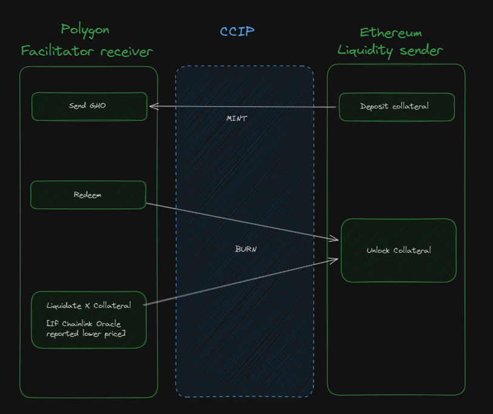

  <h1 align="center ">Muchiko GHO Facilitator</h1>

  

  <h2 align="center ">Overview</h2>

Muchiko allows users to utilize their exisitng liquidity from other chains to mint GHO stablecoins 
using this facilitator on polygon while the original colateral remains locked on the other chain 
as long as its value does not drop below specified level in which case liquidation can occur.

This MVP uses collateral that is 
locked on other chain, GHO value is being protected by monitoring collateral value using  Chainlink Oracles.
If the tokens value drop below certain level liquidation can occur.

  

- In the current version maximum amount of GHO tokens that can be minted is set by facilitators limit set in the GHO contract
- Maximum amount of GHO that can be borrowed is 50% of collateral worth
- Once collateral worth drops below 150% of borrowed GHO's amount anyone can liquidate position.

  <h2 align="center ">Setup</h2>

- run `npm i` to install dependencies
- run `npm run deploy` twice to deploy smart contracts on 2 different networks(e.g. Polygon Mumbai and Ethereum Sepolia)
- Send LINK tokens to receiver / sender contracts on [selected network](https://docs.chain.link/resources/link-token-contracts#mumbai-testnet)
- Approve test collateral tokens(in this case it's WBTC) for the sender contract.
- Add receiver contract to facilitator list for the GHO token
- run dapp frontend with `npm run dev`

  <h2 align="center ">Features</h2>

- Locking collateral on 1 network
- Receiving minted GHO tokens on network 2
- Redeeming collateral back
- Liquidating other positions in case of collateral value drop
